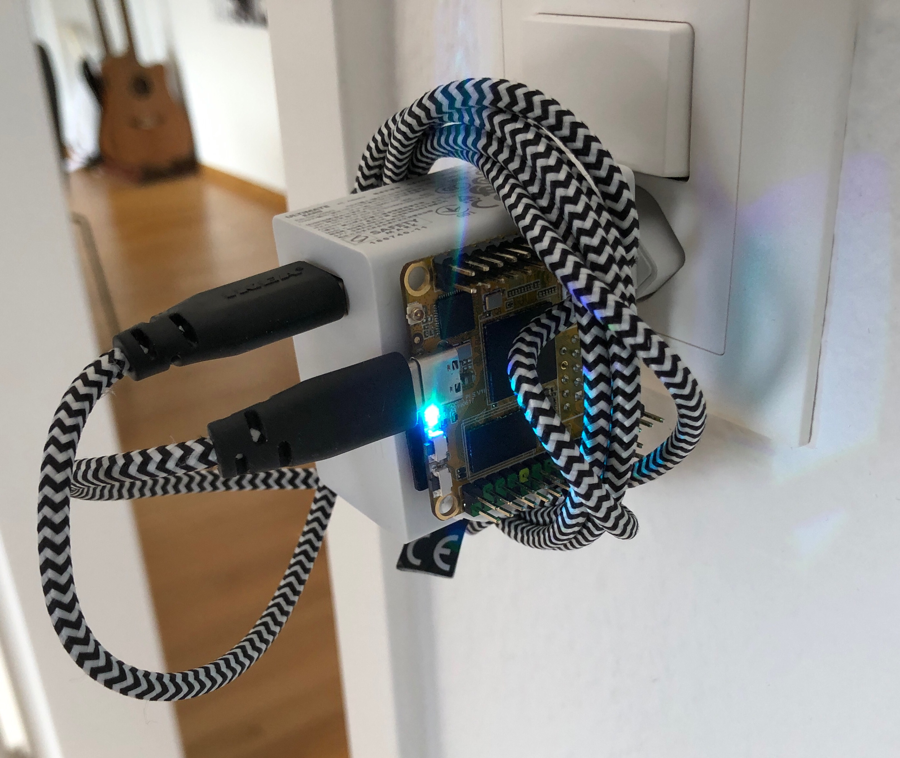

# Forked and added fitbit data upload

Please check the `.env.example` file for the required parameters.

To run on startup

```sh
sudo cp get_weight.service /etc/systemd/system/get_weight.service
sudo systemctl start get_weight
sudo systemctl enable get_weight
```

Useful command to copy the `.env` file to your target device:

```sh
scp .env rock@192.168.1.139:~/mi-scale-2-fitbit
```

> Note, since adding `ops_genie`, `pip3 install -r requirements.txt` takes a long time on a low powered sbc due to the installation of the `numpy` dependency.



> Running on a [Rock Pi S](https://wiki.radxa.com/RockpiS)

# mi-scale-2

Get Xiaomi Mi Smart Scale 2 weight

## Requirements

- python3
- bluepy
- fitbit
- python-dotenv
- opsgenie_sdk
- root permission for `bluepy.btle`

```bash
sudo pip install -r requirements.txt
```

## Usage

Always run with `sudo`:

```bash
sudo ./get_weight.py
# ./get_weight.py --verbose
# ./get_weight.py --help
```

## Help

How to get the Scale's Mac address without using the Mi App:

```bash
sudo hcitool lescan
```

If you encounter issues regarding bluetooth on your device, try restarting the bluetooth adapter

```bash
sudo hciconfig hci0 reset
```

### Reverse Engineering RAW Schema for Mi Scale 2

!!! _slightly different than from openScale wiki_ !!!

**byte 0:**

- 0 bit - unknown
- 1 bit - unit kg
- 2 bit - unit lbs
- 3 bit - unknown
- 4 bit - jin (chinese catty) unit
- 5 bit - stabilized
- 6 bit - unknown
- 7 bit - weight removed

**byte 1-2:**

- weight (little endian)

## Links

- https://github.com/oliexdev/openScale/wiki/Xiaomi-Bluetooth-Mi-Scale
